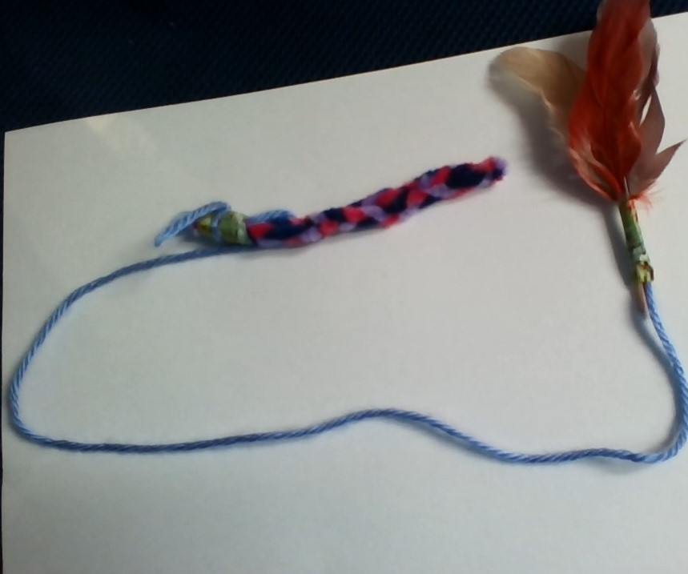

Text can be **bold**, _italic_, or ~~strikethrough~~.

[https://tsukenik50.wixsite.com/cattoypeeps](https://tsukenik50.wixsite.com/cattoypeeps).

There should be whitespace between paragraphs.

README!!!!!
# About
Hi this company was started by three young kids. So far we have made $57 in less then 5 besiness 
Please click the link up on top to go to the actual site...
## Our Products
We have affordable products for everyone. We have many products from 1-3 dollars.


### Header 3


* * *

### Here is an unordered list:

*   Item foo
*   Item bar
*   Item baz
*   Item zip

### And an ordered list:

1.  Item one
1.  Item two
1.  Item three
1.  Item four

### And a nested list:

- level 1 item
  - level 2 item
  - level 2 item
    - level 3 item
    - level 3 item
- level 1 item
  - level 2 item
  - level 2 item
  - level 2 item
- level 1 item
  - level 2 item
  - level 2 item
- level 1 item

### Small image



### Large image


### Definition lists can be used with HTML syntax.

<dl>
<dt>Name</dt>
<dd>Godzilla</dd>
<dt>Born</dt>
<dd>1952</dd>
<dt>Birthplace</dt>
<dd>Japan</dd>
<dt>Color</dt>
<dd>Green</dd>
</dl>

```
Long, single-line code blocks should not wrap. They should horizontally scroll if they are too long. This line should be long enough to demonstrate this.
```

```
The final element.
```
